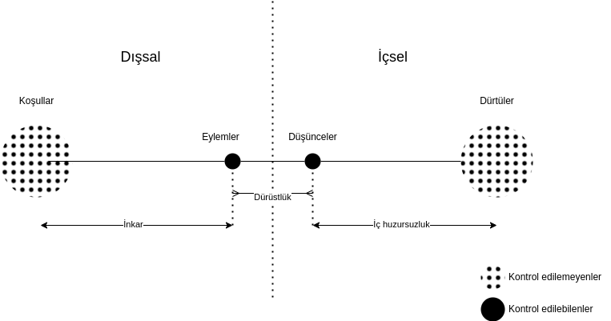

# Ahlak

İyi hayat, gittikçe daha dürüst olduğun, koşullar ve dürtülerin bağlamında,
düşüncelerini eylemlerine öncelediğin hayattır.

---

Gerçekliğimizi içsel ve dışsal olarak ikiye bölelim. Bunları da kontrol
edilebilenler ve kontrol edilemeyenler olarak ikiye bölelim.

- Dışsal kontrol edilemeyenler: Koşullar _(1)_
- Dışsal kontrol edilebilenler: Eylemler
- İçsel kontrol edilebilenler: Düşünceler
- İçsel kontrol edilemeyenler: Dürtüler _(2)_

_(1) Fiziksel bir canlı olmamız, doğduğumuz gezegen, coğrafya, kültür vb_
_(2) Henüz duygu ya da benzeri bir şeye dönüşmemiş ham içsel tetikleyiciler_

Eylemler ve düşüncelerde iradeden bahsedebiliriz, koşullar ve dürtülerde ise
iradeden bahsedemeyiz. Tanım gereği ilk grubu kontrol edilebilen kılan, ikinci
grubu edilemez kılan da bu. Koşulları ve dürtüleri zorunlu kaotik ve kendinde
değişen gerçeklikler olarak kabul ediyorum.

İnsan, zorunlu olarak içinde bulunduğu gerçeklik dahilinde var olmaya çalışır.
Bu varoluş, aynı anda hem manevi (ruhsal), hem de maddi (fiziksel) bir
varoluştur. Çevre ile etkileşimimiz ise dıştan içe ve içten dışa olacak şekilde
döngü halindedir.

- Koşullar bizde duyumlarımız aracılığıyla dürtüler oluşturur
- Biz bu dürtüler dolayımıyla eylemde bulunuruz
- Bu eylemler koşullarda bazı değişimlere sebep olur
- Ve bu böyle devam eder

Aynı döngü herhangi bir canlı için geçerlidir. İnsanı canlıdan ayrıştıran
özelliği düşüncesidir, benzeştiren özelliği ise diğer canlılar gibi fiziki bir
organizma olması yani doğup, büyüyüp, ölmesidir.

Ahlak sorusunu, insanı insan yapan bu özelliğin, yani düşüncenin (ya da
iradenin) nereye konumlanacağına ilişkin bir soru olarak anlıyorum. Cevap
olarak; düşüncenin eyleme en yakında duracak şekilde, en az çelişecek şekilde,
dürtü ile eylem arasında konumlanmasını yani eylemi öncelemesini öneriyorum.

Düşünce için alternatif konum ise dürtü kaynaklı eylemlerin ardından
konumlanmasıdır. Bunu "benim içimden bu geliyor, içimden gelen doğrudur, o
yüzden böyle davranacağım" tavrı olarak örneklendirebilirim.

Bu tavırdaki ilk sorun dürtülerin koşullarla uygun eylem oluşturacağı
varsayımıdır. Yani içimden toplum tarafından kabul görmüş dürtüler doğduğu
sürece sorun yaşamayacağım. Oysa ne koşullar ne de dürtüler kontrol edilebilir
değildirler. Geçici olarak, ve şans eseri, birbirlerine uyumlanmış olmaları,
öyle olmaya devam edeceklerinin garantisini vermez. Örnek, et yeme arzusu bugün
koşullara uygun olabilir, ama yarın ya kısıtlı kaynaklardan dolayı ya da
toplumsal hassasiyetlerden ötürü uygun olmayabilir.

İkinci, ve daha büyük sorun ise, bu haliyle düşüncenin, bir eylem meşrulaştırma
(rasyonalizasyon) mekanizması olmaya mahkum edilmesidir. Eylem düşünceden önce
olduğundan, düşünceye sadece onu anlamlandırmak kalmıştır. Oysa düşünce aynı
zamanda dürtüsel olmayan yegane içsel tetikleyicidir. Dürtüler durulduğunda,
yani harekete geçirici olacak kadar yoğun olmadığında, düşüncenin de kendi
harekete geçirici mekanizması vardır, buna da can sıkıntısı diyorum.

Düşüncenin eylem ile olan mesafesine ise dürüstlük diyorum. Bir insan,
eylemlerine bakıldığında (buna beyanları da dahil) düşüncesine dair doğrudan
bilgi verdiği ölçüde dürüsttür. Düşüncesi eylemini açıklayamadıkça, dolaylı
açıkladıkça dürüst değildir.

Dürüst bir hayat insan için iyi bir hayattır. Her eylemimizde düşünceyi
önceleyemesek de, dürüst olmak, yani en azından eylemimizin arkasından gelen
düşüncenin (rasyonalizasyonun) gerçeklere yakın olması, inkar içinde olmamak
bağlamında yine de önemlidir. Bu sayede kendimizle yüzleşmiş olur, düşünceyi
eyleme öncelemek için motivasyonumuzu artırmış oluruz.

Eylemlerimizin koşullara uygun olması, düşüncelerin eylemlere uygun olması ve
dürtülerin de düşüncelere uygun olmasını ideal bir hayat olarak tanımlıyorum.
İki kontrol edilebileni (eylem ve düşünce) birbirine yaklaştırdığımızda, kontrol
edilemeyenlerin (koşul ve dürtü) doğal olarak bunlardan uzaklaşma eğilimi
olacaktır. Dolayısıyla ideal hayatı yaşayamayacağız. Eylemlerimiz düşünceye
yakın olacak kaygısıyla koşullardan uzaklaşırsa (inkar), düşünce de eyleme yakın
olacak kaygısıyla dürtülerden uzaklaşırsa (huzursuzluk), ideal hayattan da
uzaklaşmış oluyoruz.

Koşullar ve dürtüler, düşünce ve eylemlerimizde belirleyiciler. Bunu da baştan
kabul edelim ve düşüncemizi dürüstlüğü elden bırakmadan bu iki bağlamda tekrar
tekrar şekillendirelim. Asla ideal hayatı yaşayamayacağımızı bilerek, ama her
zaman onu arayarak.

Bizim amacımız hayatta arı düşünceyi maksimize edip fiziksel dolayımlarla değil
düşünsel dolayımlarla kurduğumuz bir hayat yaşamak.

Kişide tamamen inkarla elde edilmiş bir düşünce-eylem yakınlığı var ise, yani
koşul ve dürtülerden tamamen soyutlanmışsa, kişiyi delirmiş kabul ediyorum.
Dürtüler ve koşullar rastgele ve bilinçsizdirler ve dolayısıyla kendilerini bize
dayatırlar, düşünce-eylemlerimizi bunlara uyumlanacak şekilde revize etmek
zorundayız.

Örneğin; kıvırcık saçlıysanız öylesinizdir, saçınız beyazladıysa beyazlamıştır
ya da İstanbul'da doğduysanız ve büyüdüyseniz bu böyledir. Bu koşullara uygun
olmayan, hatta bunları inkar eden, eylemlerde bulunursanız ahlaken zayıflar,
nihayetinde delirirsiniz. Diğer bir deyiş ile, kişi kıvırcık saçlı olmasına
rağmen düz saçlı gibi davranıyorsa, İstanbullu olmasında rağmen İzmirli gibi
davranıyorsa, koşullarına uyumsuz eylemlerde bulunması itibariyle iyi bir hayata
mesafe koymaktadır.

Dürtüler henüz duyguya (bkz. [duygu](duygu.md)) dönüşmediklerinden onlara isim
vermeden önce onların ne olduğunu gözlemleme fırsatımız vardır. Yetişkin biri
dürtülerini duygulara örtüştürmekte acele etmez, bir süre gözlemler. Bu kişiye
hem dürtülerinin düşüncelerine olan mesafesini yakın tutabilmek için fırsat
verir, hem de dürtünün düşünceyi atlatarak eylemi tetiklemesini engeller.
Dürtülere karşı gösterilen bu sabır, dürtülerin koşullarla uyumsuz eylemlere
davet ettiği çıkarımını yapmayı engeller. Bu konuda aceleci davranmak ise ya
yanlış (koşullarla uyumsuz) eylemlere, ya da dürtülerin düşüncelere mesafeli
olmasına (baskılanmasına) sebep olur. Oysa insanın dürtüleri asla zorunlu bir
somut eylem isteyecek kadar net değildir. Aynı dürtü sizi spor yapmaya da
götürebilir, kavga etmeye de, yemek yemeye de. Koşul ve dürtülerin
düşünce-eyleme olan yakınlığı tesis edildiği an, kişi huzuru yakalamıştır.
Kontrol edilemeyenlerde oluşacak yeni huzursuzluklar olana kadar kişi bu
huzurunu korur. Huzur anında düşünce dürtülerle ilgilenmez, kendi ile ilgilenir.
Kendi kendisi ile ilgilenen düşünce bir anlamda tanrısaldır, yani salt
düşüncedir. Böyle anlar insanın tanrısallaştığı, diğer anlar ise insanın
hayvanlaştığı anlardır. İnsan bu ikisi arasındaki dengede insandır, ne salt
bilinçli ve düşünsel (tanrı) olabilir, ne de tamamen bilinçsizdir (hayvan).
