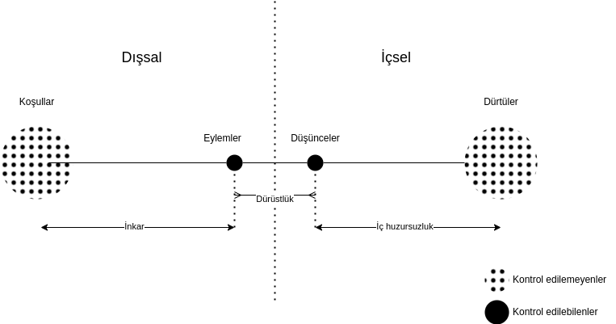

# Ahlak

İyi hayat, gittikçe daha dürüst olduğun, koşullar ve dürtülerin bağlamında,
düşüncelerini eylemlerine öncelediğin hayattır.

---

Gerçekliğimizi içsel ve dışsal olarak ikiye bölelim. Bunları da kontrol
edilebilenler ve kontrol edilemeyenler olarak ikiye bölelim.

- Dışsal kontrol edilemeyenler: Koşullar _(1)_
- Dışsal kontrol edilebilenler: Eylemler
- İçsel kontrol edilebilenler: Düşünceler
- İçsel kontrol edilemeyenler: Dürtüler _(2)_

_(1) Fiziksel bir canlı olmamız, doğduğumuz gezegen, coğrafya, kültür vb_
_(2) Henüz duygu ya da benzeri bir şeye dönüşmemiş ham içsel tetikleyiciler_

Eylemler ve düşüncelerde iradeden bahsedebiliriz, koşullar ve dürtülerde ise
iradeden bahsedemeyiz. Tanım gereği ilk grubu kontrol edilebilen kılan, ikinci
grubu edilemez kılan da bu. Koşulları ve dürtüleri zorunlu kaotik ve kendinde
değişen gerçeklikler olarak kabul ediyorum.

İnsan, zorunlu olarak içinde bulunduğu gerçeklik dahilinde var olmaya çalışır.
Bu varoluş, aynı anda hem manevi (ruhsal), hem de maddi (fiziksel) bir
varoluştur. Çevre ile etkileşimimiz ise dıştan içe ve içten dışa olacak şekilde
döngü halindedir.

- Koşullar bizde duyumlarımız aracılığıyla dürtüler oluşturur
- Biz bu dürtüler dolayımıyla eylemde bulunuruz
- Bu eylemler koşullarda bazı değişimlere sebep olur
- Ve bu böyle devam eder

Aynı döngü herhangi bir canlı için de geçerlidir. İnsanı canlıdan ayrıştıran
özelliği düşüncesidir, benzeştiren özelliği ise diğer canlılar gibi fiziki bir
organizma olması yani doğup, büyüyüp, ölmesidir.

Ahlak sorusunu, insanı insan yapan bu özelliğin, yani düşüncenin (ya da
iradenin) nereye konumlanacağına ilişkin bir soru olarak anlıyorum. Cevap
olarak; düşüncenin eyleme en yakında duracak şekilde dürtü ile eylem arasında
konumlanmasını yani eylemi öncelemesini öneriyorum.

Düşünce için alternatif konum ise dürtü kaynaklı eylemlerin ardından
konumlanmasıdır. Bunu "benim içimden bu geliyor, içimden gelen doğrudur, o
yüzden böyle davranacağım" tavrı olarak örneklendirebilirim.

Bu tavırdaki ilk sorun dürtülerin koşullarla uygun eylem oluşturacağı
varsayımıdır. Yani içimden toplum tarafından kabul görmüş dürtüler doğduğu
sürece sorun yaşmayacağım. Oysa ne koşullar ne de dürtü kontrol edilebilir
değildirler. Geçici olarak, ve şans eseri, birbirlerine uyumlanmış olmaları,
öyle olmaya devam edeceklerinin garantisini vermez. Örnek, et yeme arzusu bugün
koşullara uygun olabilir, ama yarın ya kısıtlı kaynaklardan dolayı ya da
toplumsal hassasiyetlerden ötürü uygun olmayabilir.

İkinci, ve daha büyük sorun ise, bu haliyle düşüncenin, eylemin meşrulaştırma
(rasyonalizasyon) mekanizması olmaya mahkum edilmesidir. Eylem düşünceden önce
olduğundan, düşünceye sadece onu anlamlandırmak kalmıştır. Oysa düşünce aynı
zamanda dürtüsel olmayan yegane içsel tetikleyicidir. Dürtüler durulduğunda,
yani harekete geçirici olacak kadar yoğun olmadığında, düşüncenin de kendi
harekete geçirici mekanizması vardır, buna da can sıkıntısı diyorum.

Düşüncenin eylem ile olan mesafesine ise dürüstlük diyorum. Bir insan,
eylemlerine bakıldığında (buna beyanları da dahil) düşüncesine dair doğrudan
bilgi verdiği ölçüde dürüsttür. Düşüncesi eylemini açıklayamadıkça, dolaylı
açıkladıkça dürüst değildir.

Dürüst bir hayat insan için iyi bir hayattır. Her eylemimizde düşünceyi
önceleyemesek de, dürüst olmak, yani en azından eylemimizin arkasından gelen
düşüncenin (rasyonalizasyonun) gerçeklere yakın olması, inkar içinde olmamak
bağlamında yine de önemlidir. Bu sayede kendimizle yüzleşmiş olur, düşünceyi
eyleme öncelemek için motivasyonumuzu artırmış oluruz.

Eylemlerimizin koşullara uygun olması, düşüncelerin eylemlere uygun olması ve
dürtülerin de düşüncelere uygun olmasını ideal bir hayat olarak tanımlıyorum.
İki kontrol edilebileni (eylem ve düşünce) birbirine yaklaştırdığımızda, kontrol
edilemeyenlerin (koşul ve dürtü) doğal olarak bunlardan uzaklaşma eğilimi
olacaktır. Dolayısıyla ideal hayatı yaşayamayacağız. Eylemlerimiz düşünceye
yakın olacak kaygısıyla koşullardan uzaklaşırsa (inkar), düşünce de eyleme yakın
olacak kaygısıyla dürtülerden uzaklaşırsa (huzursuzluk), ideal hayattan da
uzaklaşmış oluyoruz.

Koşullar ve dürtüler, düşünce ve eylemlerimizde belirleyiciler. Bunu da baştan
kabul edelim ve düşüncemizi dürüstlüğü elden bırakmadan bu iki bağlamda tekrar
tekrar şekillendirelim. Asla ideal hayatı yaşayamayacağımızı bilerek, ama her
zaman onu arayarak.

---

## 5

Ve dolayısıyla diyoruz ki bizim amacımız hayatta arı düşünceyi maksimize edip
fiziksel dolayımlarla değil düşünsel dolayımlarla kurduğumuz bir hayat yaşamak.

Bu, ilk başta dediğimiz gibi bir reddetme mekanizmasıyla inkarla olduğunda
ahlaklı ve düzgün, dengeli bir hayat olmamış oluyor. Deliriyoruz. Ve dürtüler
de, dış koşullar da kendini bize dayatıyor. Dolayısıyla doğru olan o dürtüleri
de, dış koşulları da, yani benim saçım niye düz, kıvırcık değil veya kıvırcık,
düz değil. "Senin saçın düzse düzdür, kıvırıcıksa kıvırcıktır" gibi... veya
içimde henüz duyguya dönüşmemiş bir şeyi, dürtüyü daha duygu halinde değilken
bile kendi haline bırakmak, yani onu baskılamamak, yani temelde "benim böyle bir
şey hissetmiyor olmam gerekirdi" dememek, hissediyorsan hissetmek ve o hissi
tanımlarken acele etmemek, ona izin vermek ve bu koşullar, bu kontrol
edilemezler dahilinde bir düşünce mekanizmasını devrede tutmak ve bunları
durağanlaştırdıktan sonra tekrar huzurlu, düşüncenin tetikleyici olduğu, insani
durumda kontrol edilebilir ikili (şey) dünyada eylem halinde olma statüsüne geri
dönmek istiyoruz. Bu da bizim mekanizmamız.

## Ek 1

Bunu yaparken şöyle bir şey aklımıza geldi, o notu alacağım ama sonun... en
sonunda konuştuğumuz konuyu unuttum bu arada, ama belki hatırlarım.

Bir şirket şeyi, konuştuk, yapısı. Dedik ki bu yönetime, bu bilince şirketin
yöneticisi dedik. Şirketin bu yöneticisi kendi kontrolü dışında olmayan bir sürü
şeyle şey yapıyor. Mevzuat çıkabiliyor, çalışan istifa ediyor, birinin başına
bir şey geliyor. Her neyse, her şey olabilir. Bu durumda yönetici kendisi ne
kadar az günlük hayat için uğraşıyorsa o kadar başarılı olmuştur yönetici olarak
ve işte "ulvi" amacı olan vizyonu düşünmeyi şey yapar, ona odaklanır.

## Ek 2

Bu yönetici vizyonuna ne kadar vakit ayırabiliyorsa ve o yaratıcı pozisyonda ne
kadar kalabiliyorsa o kadar başırılı bir yönetici olmuş oluyor. Tabii ki bunu
yapmak için kendi şirketinin gerçekliğinden çalışanların huzursuzluğunu
görmezden gelmek, (dış) müşteri dünyasının veya içinde bulunduğu piyasa
şartlarını görmezden gelip kendi içine kapanıp vizyon yapacağım diye gerçekliğin
reddetmesiyle değil, bunların hepsiyle barışık olup bunların hepsini göğsünde
yumuşatıp, bunlara sistematik bir şekilde cevap verip bunları karşılayıp ve
hiçbir şey olmasa da bir şey var mı diye ara ara kontrollerle bu dengeyi korumak
ve dolayısıyla açık alanda, yani aslında en başından, açık alanda hareket etmek,
yani aslında en başından %100 insan olamayacağımızı baştan kabul ederek insan
olabiliyoruz. Çünkü sadece insan, insan olmayı salt tetikleyici rasyo olarak
tanımladık. Salt düşünsel aktivite, o tanrının görevi diyelim. Onu başka bir
yere [orada ele almak üzere] pas atalım.

Biz o değiliz, biz insanız. Dolayısıyla fiziksel gerçekliklerimiz var. İçsel ve
dışsal iki fizikselliğimiz var. Ve biz bunları en baştan şey yapmıyoruz ama biz
"tanrısallığımızı" diyelim. Yani "tanrısal" derken burada salt düşünceden
bahsediyorum. Salt düşünce alanımızı maksimize etmeye çalışıyoruz.

Ama asla maksimum, yüzde yüz olmayacağını bilerek. Bunu en baştan kabul ederek.
Dolayısıyla gerçekliğimizle barışığız. Ve ne kadar o huzur, yalın, (şey)
durağan, düşünce dünyasında kalabiliyorsak o kadar kalabilmiş oluyoruz.

Böyle bir ahlak mekanizması.

## Ek 3

Bunun üzerine şunu düşündük, şöyle bir şey düşündük, dedik ki; bir insan kendi
bu düşünce mekanizmasını ve, kontrol mekanizması diyelim, büyüttükçe olan
maksimize ettikçe, onun maruz kaldığı hem duygular hem de duyular diyelim, yani
hem içsel hem dışsal kontrol edilemeyenler hem dürtüler hem duyumlarını daha iyi
tanıdıkça onlarla daha fazla uğraşmak zorunda kalıyor. Çünkü daha detaycı birine
dönüşüyoruz. Ve dolayısıyla yaşadığı deneyimi daha fazla anlama ihtiyacını
duyuyor. Bunun için daha fazla zaman ayırmak zorunda kalıyoruz. Bunun da sebebi
daha ince bir duygu ve düşünce işçisi oluyoruz. Daha ince işleyen bir..
ustalaşıyoruz bu konuda. Ustalaştıkça "ya beş tane çocuk işte, çocuk çocuktur
ya" diyecek kadar kaba bakamamaya başlıyoruz. Bir çocuğu [yapmayı] bile yıllarca
belki düşünüyoruz veya bir işi yaparken o işi çok daha detayllı düşünüyoruz,
ağırlaşıyoruz ama çok iyi yapmaya başlıyoruz vs vs.

Dolayısıyla maruz kaldığımız gündelik olayları(n) sıklığını azaltma eğiliminde
oluyoruz. Çünkü daha rafine bir (şeye dönüştükçe) zihne dönüştükçe bundan geri
adım atamıyoruz. Dolayısıyla yaşadığımız şeyleri bir türlü sindirememek veyahut
bu dürtülerin ne kadar büyüyüp büyümeyeceğinin bilinemezliği ile ilgili bir
hayal kırıklığı ve huzursuzluğa kapılmaktan da vazgeçelim diyoruz.

Diyoruz ki biz... birincisi, yapısı gereği ve doğası gereği, bunlar tamamen
öngörülebilir şeyler değil. Dolayısıyla öngöremediğimizi için kendimize
kızmaktan vazgeçelim. İkincisi, buna emek ayırdıkça daha fazla emek ayırmamızı
gerektiren bir+

## Ek 4

Daha fazla emek ayırdıkça, daha fazle emek ayırmamızı gerektiren, kendi kendini
büyüten bir yapısının olması bizi daha fazla emek ayırmaktan alıkoymamalı. "Ya
ben niye bu kadar uğraşıyorum ki ya?" pozisyonuna düşüp yerimizde saymamalıyız.
Birincisi bunu "undo" yapamıyoruz. Yani o kapasiteyi, o beceriyi elde ettikten
sonra hiç elde etmemiş noktasına geri dönmemiz imkansız. Dolayısıyla bir zaman
kaybı olur, bunu yapmak istemek.

Yapabileceğimiz şey, maruz kaldığımız şeylerin sayısını azaltmaya çalışmak.
Aslında hayata bir nevi "zoom-in" yapmak gibi bir şey öneriyoruz ve diyoruz
ki gittikçe daha az şeyi daha yoğun yaşa ve daha da yoğun yaşama becerini bir
noktadar arttır.

Burada da şöyle bir açık konu kalıyor. Sonrasına belki bir dengeli bir şey,
kontrollü bir şey olarak incelme tavsiyesine dönüşebilir. Çünkü biz biliyoruz ki
fiziksel olarak bir sınırımız var, yaşlanacağız. Dolayısıyla daha fazla
tekrar... yeni, işte sağlık sorunları vesaire gibi, şeylerle mücadele edeceğiz.
Ve bunlar bizim o... veya çok beklenmeyen büyük tokatlar yiyeceğiz hayatta.
Dolayısıyla, elimizdeki beceri her zaman eksik olacak ama yaşlandığımızda da,
daha becerikli hale geçme becerisini de kaybetmeye başladıkça ve bir zamanlar
bunu yapabilir biri olmuş olmanın da getirdiği (şeyle) durumla, bu kaçınılmaz
bir hayal kırıklığına bizi götürebilir.

Buna karşı da kendimizi hazırlıklı kılmanın yollarını aramalıyız. Bu da başka
bir zamanın konusu olsun, yani handikapı orası gibi görünüyor.
